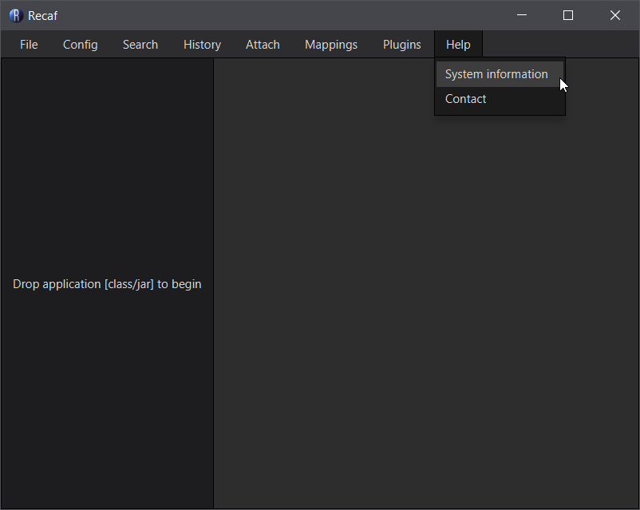
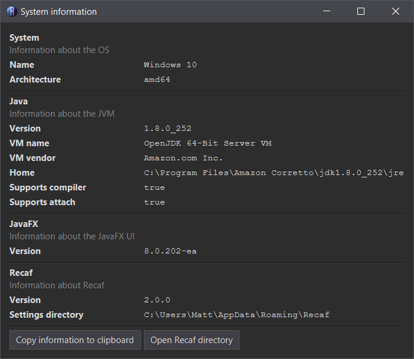

# Requirements

1. Any JDK for version 11 or higher

# Verification

You can verifiy that Recaf is fully supported by opening the _"System information"_ window under the _"Help"_ menu.

The _"Java"_ section of the _"System information"_ window has two values that should both be listed as `true`:

- _"Supports compiler"_
- _"Supports attach"_