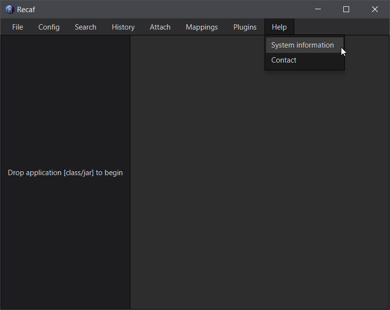
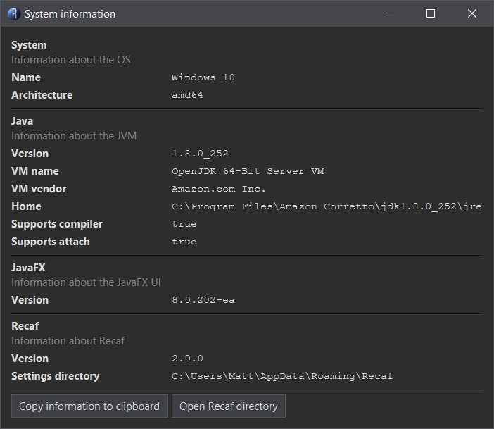

# Foreword

If you update to Java 11 or higher you don't have to do any of this. Recaf will automate the entire process for you. If you wish to continue using Java 8, follow along below.

# Requirements

1. A JDK that bundles JavaFX
2. Allowing Recaf to access the JDK's compiler/attach-api

# JavaFX

Recaf's UI is built using JavaFX. Please make sure that the version of Java 8 that you have installed bundles JavaFX. Known supported vendors are:

- [Amazon Corretto](https://aws.amazon.com/corretto/)

# Allow Recaf to access the compiler and attach-api

Recaf has some features that depend on developer tools that come with Java. To unlock these features make sure to configure the local Java 8 installation properly. Some notes first:

1. You must have a Java Development Kit installed _(JDK)_
2. The JDK includes the required files to enable Recaf's compiler access
3. If you have a Java Runtime Environment _(JRE)_ installed and not a JDK, please install a JDK instead.

To enable these features navigate to the directory that the JDK 8 is installed to _(`$JDK_DIR`)_. Copy the following files to the given location:

- `$JDK_DIR/lib/tools.jar`  --> `$JDK_DIR/jre/lib/ext/tools.jar`
- `$JDK_DIR/lib/sa-jdi.jar`  --> `$JDK_DIR/jre/lib/ext/sa-jdi.jar`

# Verification

You can verifiy that Recaf is fully supported by opening the _"System information"_ window under the _"Help"_ menu.

The _"Java"_ section of the _"System information"_ window has two values that should both be listed as `true`:

- _"Supports compiler"_
- _"Supports attach"_
