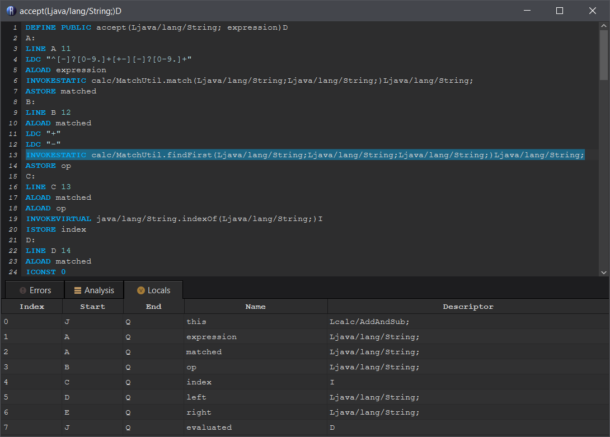
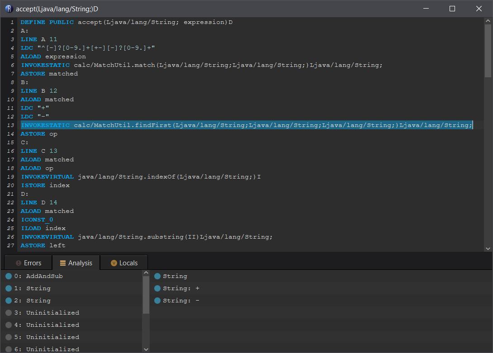
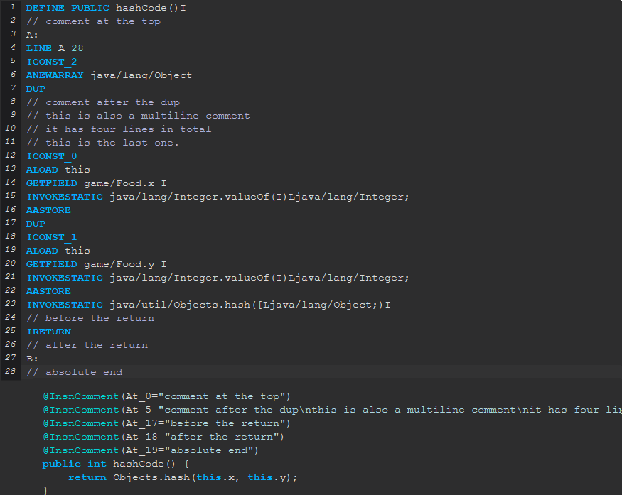

# Features

##  Variable instructions can refer to variables by their name

This allows you to turn code like this:
```java
ILOAD 1
ILOAD 2
ILOAD 3
INVOKESTATIC Math.clamp(III)I
IRETURN
```
Into:
```java
ILOAD min
ILOAD max
ILOAD value
INVOKESTATIC Math.clamp(III)I
IRETURN
```
This is much more legible since we now know what the meaning of each variable is just by looking at the name.

If a class was compiled with debug information, variable names will be used instead of incides whenever possible. You're free to add you own named variables too.

## Code offsets use named labels

In standard Java bytecode, jump instructions point to relative offsets. In Recaf we instead use named labels. By default they are alphabetical order, but you can name your own labels whatever you like. For example:
```java
ILOAD isValid
IFEQ INVALID
GOTO VALID
// Success
VALID:
INVOKESTATIC com/MyApp.launch()V
RETURN
// Terminate
INVALID:
ICONST_M1
INVOKESTATIC java/lang/System.exit(I)V
RETURN
```
If we can name our labels that we write, then we can much easier understand our control flow operations.

## One-line source-level expressions can be directly written and translated to bytecode

If you aren't super familiar with bytecode, that's ok! Recaf makes it super simple to add simple one-line expressions to your code with `EXPR <expression>`.

<center><video controls><source src="img/expression_control_flow.mp4" type="video/mp4"></video></center>

For example:
```java
ALOAD argString
EXPR if (argString != null) System.out.println("Arg = " + argString);
```

Inline expressions like this can also be chained. You just have to write them in order so they will recognize the prior one.
```java
EXPR int tempF = someFunc(false);
EXPR int tempT = someFunc(true);
EXPR boolean areSame = tempF == tempT;
EXPR if (areSame) System.out.println("They're the same!");
// You can also access these variables in standard bytecode 
ILOAD areSame
...
```

## A table of local variables is provided and updated as you make changes

Assuming we have the following source code:
```java
@Override
public double accept(String expression) {
    String matched = MatchUtil.match("^[-]?[0-9.]+[+-][-]?[0-9.]+", expression);
    String op = MatchUtil.findFirst(matched, "+", "-");
    int index = matched.indexOf(op);
    String left = matched.substring(0, index);
    String right = matched.substring(index + 1, matched.length());
    expression = expression.replace(matched, String.valueOf(switch (op) {
        case "+" -> this.evaluate(left) + this.evaluate(right);
        case "-" -> this.evaluate(left) - this.evaluate(right);
        default -> throw new IllegalStateException();
    }));
    return this.evaluate(expression);
}
```
Recaf will recognize these variables and show them in a organized table.



## The stack and local values of any frame can be accessed by selecting a line and looking at the analysis tab

Assuming we have the following source code:
```java
@Override
public double accept(String expression) {
    String matched = MatchUtil.match("^[-]?[0-9.]+[+-][-]?[0-9.]+", expression);
    String op = MatchUtil.findFirst(matched, "+", "-");
    int index = matched.indexOf(op);
    String left = matched.substring(0, index);
    String right = matched.substring(index + 1, matched.length());
    expression = expression.replace(matched, String.valueOf(switch (op) {
        case "+" -> this.evaluate(left) + this.evaluate(right);
        case "-" -> this.evaluate(left) - this.evaluate(right);
        default -> throw new IllegalStateException();
    }));
    return this.evaluate(expression);
}
``` 
We can select any line in the disassembled method and see what values are on the stack and in the local variables table under the _"Analysis"_ tab.

For example, here is a part of that method disassembled:
```java
DEFINE PUBLIC accept(Ljava/lang/String; expression)D
A:
LINE A 11
LDC "^[-]?[0-9.]+[+-][-]?[0-9.]+"
ALOAD expression
INVOKESTATIC calc/MatchUtil.match(Ljava/lang/String;Ljava/lang/String;)Ljava/lang/String;
ASTORE matched
B:
LINE B 12
ALOAD matched
LDC "+"
LDC "-"
// If we select the following line...
INVOKESTATIC calc/MatchUtil.findFirst(Ljava/lang/String;Ljava/lang/String;Ljava/lang/String;)Ljava/lang/String;
ASTORE op
```


If we select the line with `INVOKESTATIC calc/MatchUtil.findFirst` we will see on the left that variables 0, 1, and 2 are used. And there are 3 strings on the stack. The top two of which are `+` and `-` which we can see immediately above.


## Bytecode is verified live as you make changes to make everything is valid

Everyone makes mistakes, so Recaf will double check that your code is valid after every change you make and list them in the _"Errors"_ tab. You can click the error in the tab to immediately jump to the affected line. The line the error occured on will also show a red indicator next to it.

For examples of some possible errors see: [Assembler errors](use-assembler-errors.md)

## Comments written in the assembler can be saved and loaded between edits

When you write a comment with `// Example` in the assembler, Recaf will save it into the class file so that when you open the method again later it will be right where you left it. These comments are stored as annotations on the method.

