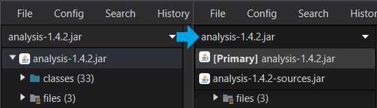
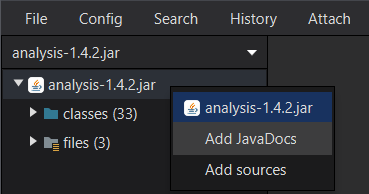
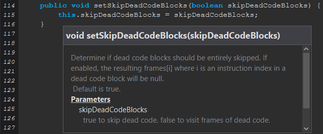
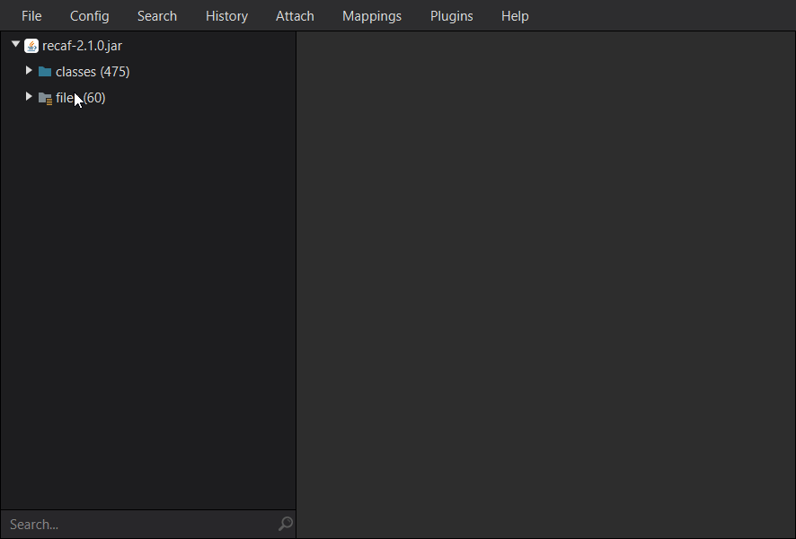

# Summary

Recaf operates in workspaces. Each workspace can have one or more files loaded at a time. The first file loaded will be marked as the **primary resource**. All following files are **secondary resources**. In addition to  these two resources, there are two additional back-end resources that add functionality to Recaf.

# Types of Resources

## Primary Resource

A primary resource contains all the class files and resources of the program you wish to modify.

**Supported file types**:
 - Jar
 - Class
 - War
 - Directories _(Only accessible by workspace config file)_

## Secondary Resource(s)

A secondary resource contains supporting class files and resources. They are for reference purposes and are used to improve support for the following features:

- Compiler classpath classes
- Context sensitive navigation
- Stack-frame generation. 

You can add multiple secondary resources to a workspace. However, if you do not have access to the relevant secondary files, you can enable _"Generate missing classes"_ in the Assembler config. This is supported via the Phantom Resource.

**Supported file types**:
 - Jar
 - Class
 - War
 - Directories _(Only accessible by workspace config file

## Phantom Resource

The phantom resource is a hidden resource common to all workspaces. It is similar to the secondary resource in that it contains supporting class files. These classes are generated automatically by Recaf when you open a new workspace. Recaf uses the JPhantom library to analyze the primary resource of a workspace and generates missing references to classes, interfaces, enums, and all of their referenced fields and methods. The generated code only contains stubbed declarations, but that is all you need for a reference resource.

If the phantom generation process fails it will emit a message in the console. This is rarely the case except for certain intensely obfuscated programs. In this situation you may have to provide libraries as secondary resources to use some features.

## Classpath Resource

The classpath resource is a hidden resource common to all workspaces. It allows Recaf to read class files directly from memory.

# Creating a workspace

You can create a new workspace by selecting _"File > Load"_. This will show a file prompt where you can select the primary resource. Alternatively you can drag-and-drop a file onto the left-most panel.

Once the workspace is created with the primary resource you can add additional secondary resources with _"File > Add library"_.

All resources can have sources and JavaDocs attached as references. Right click on the resource and select which item you would like to attach. After attaching JavaDocs you can hover over a method to show a documentation popup.

# Navigating the workspace

Considering the fact that Recaf supports multiple resources in a workspace there needs to be a way to navigate to the files of each resource. This is done by inserting a dropdown menu at the top of the navigation tree. In this menu the primary resource will be listed at the top and all additional libraries will be added below it. Selecting one of these items will replace the tree with the contents of that file.

Each resource's navigation tree is persistent. This means that when a directory is opened it will stay open even after switching to another resource. When you switch back the tree will be just as it was before.

In order to quickly navigate to files it would be useful for there to be a filter. At the bottom of the navigation tree is a filter box. The content of the filter will show all tree items that contain the given path. For example `java/lang/String` and `String` will show the `String` class in the navigation tree _(Along with `StringBuilder` since it contains `String`)_.

# Exporting your changes

Before you export, make sure you have saved your changes. All editors can have their changes saved via the save keybind,`Control + S` _(default bind, can be changed)_. Saved changes are stored internally in Recaf until you export your changes.

To export your changes go to the _"File"_ menu and select _"Export program"_. This will prompt you to give a file location to save the file to. This will export only the primary resource. 

# Exporting a workspace config

If you want to save the configured workspace go to the _"File"_ menu and select _"Export workspace"_. This will prompt you to give a file location to save the workspace to. This will create a JSON file that holds references to each resource in the workspace. This JSON file can be used when loading a file _(from either the menu prompt, or by drag-and-drop)_ to open all items in the workspace at once.

Some notes:

1. Workspaces that use runtime components such as the attach function to connect to live processes cannot be exported to a JSON.
2. You can modify the exported JSON to use point to directories instead of files. Change the `kind` value to `directory` and the `source` to the directory containing classes you want to load.